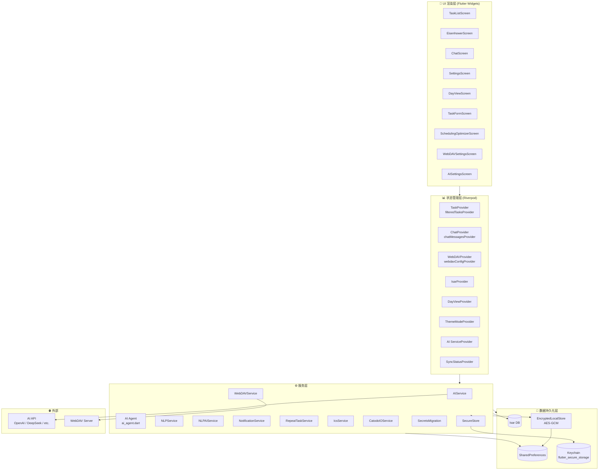
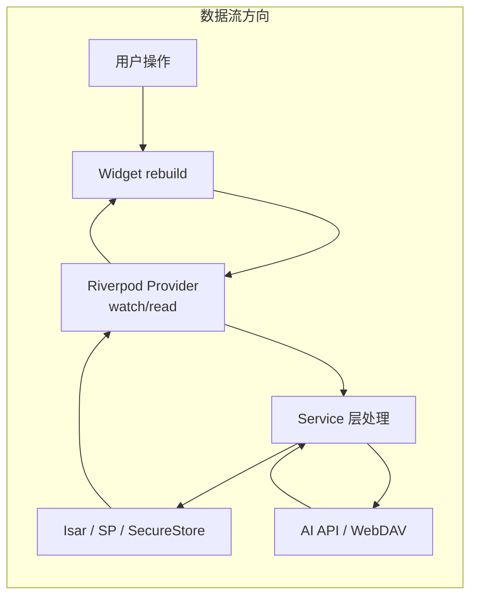

# Catodo 系统架构图

> 三层架构：数据持久化层 → 状态管理层 → UI 渲染层

```mermaid
graph TB
    subgraph UI["🎨 UI 渲染层 (Flutter Widgets)"]
        TL[TaskListScreen]
        EF[EisenhowerScreen]
        CS[ChatScreen]
        SS[SettingsScreen]
        DV[DayViewScreen]
        TF[TaskFormScreen]
        SO[SchedulingOptimizerScreen]
        WSS[WebDAVSettingsScreen]
        AISS[AISettingsScreen]
    end

    subgraph State["📊 状态管理层 (Riverpod)"]
        TP[TaskProvider<br/>filteredTasksProvider]
        CP[ChatProvider<br/>chatMessagesProvider]
        WP[WebDAVProvider<br/>webdavConfigProvider]
        IP[IsarProvider]
        DP[DayViewProvider]
        TMP[ThemeModeProvider]
        AIP[AI ServiceProvider]
        SP[SyncStatusProvider]
    end

    subgraph Service["⚙️ 服务层"]
        AIS[AIService]
        AIA[AI Agent<br/>ai_agent.dart]
        NS[NLPService]
        NAS[NLPAIService]
        NOS[NotificationService]
        RTS[RepeatTaskService]
        WDS[WebDAVService]
        IOS[IcsService]
        CIO[CatodoIOService]
        SSRV[SecureStore]
        CMS[SecretsMigration]
    end

    subgraph Data["💾 数据持久化层"]
        ISDB[(Isar DB)]
        SPREF[(SharedPreferences)]
        KEYCHAIN[(Keychain<br/>flutter_secure_storage)]
        EL[EncryptedLocalStore<br/>AES-GCM]
    end

    subgraph Ext["🌐 外部"]
        API[AI API<br/>OpenAI / DeepSeek / etc.]
        WEBDAV[WebDAV Server]
    end

    UI --> State
    State --> Service
    Service --> Data
    AIS --> API
    WDS --> WEBDAV

    Service --> SSRV --> KEYCHAIN
    Service --> EL --> SPREF
    Service --> ISDB
    Service --> SPREF
```

```mermaid
graph LR
    subgraph Flow["数据流方向"]
        A[用户操作] --> B[Widget rebuild]
        B --> C[Riverpod Provider<br/>watch/read]
        C --> D[Service 层处理]
        D --> E[Isar / SP / SecureStore]
        D --> F[AI API / WebDAV]
        F --> D
        E --> C
        C --> B
    end
```
