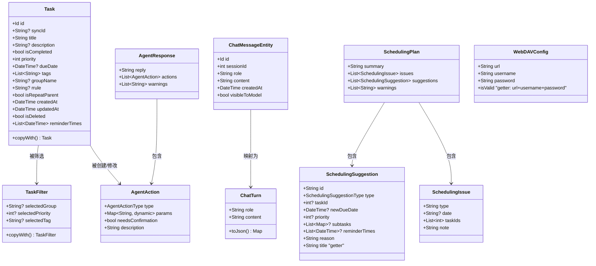

# Catodo 数据模型图



```mermaid
graph TD
    subgraph 枚举
        AT["AgentActionType<br/>create/update/complete/<br/>delete/decompose/<br/>addReminder/setRepeat/<br/>queryTasks/bulkUpdate<br/>+6 更多"]
        DM["DayViewMode<br/>all / focusToday / hideOverdue"]
        SS["SyncStatus<br/>idle / syncing / synced / failed"]
        SM["SyncMode<br/>autoMerge / localFirst / remoteFirst"]
        AE["AiErrorType<br/>unauthorized / network /<br/>parseFailed / rateLimited /<br/>+6 更多"]
        ST["SchedulingSuggestionType<br/>reschedule / decompose /<br/>setPriority / completeOrDrop /<br/>addReminder"]
        T["ThemeMode<br/>light / dark / system"]
    end
