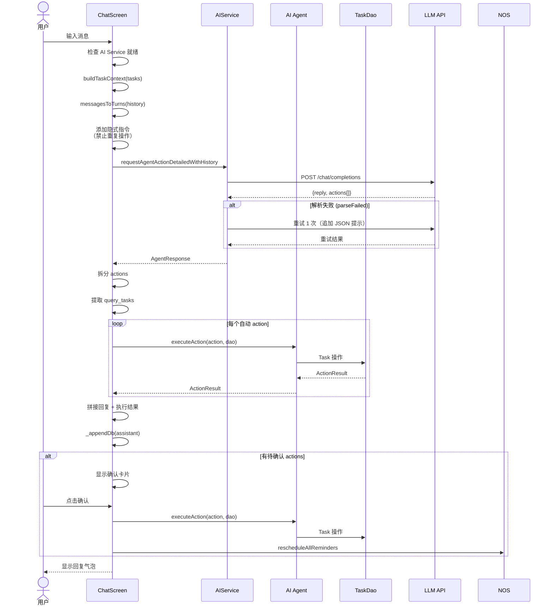
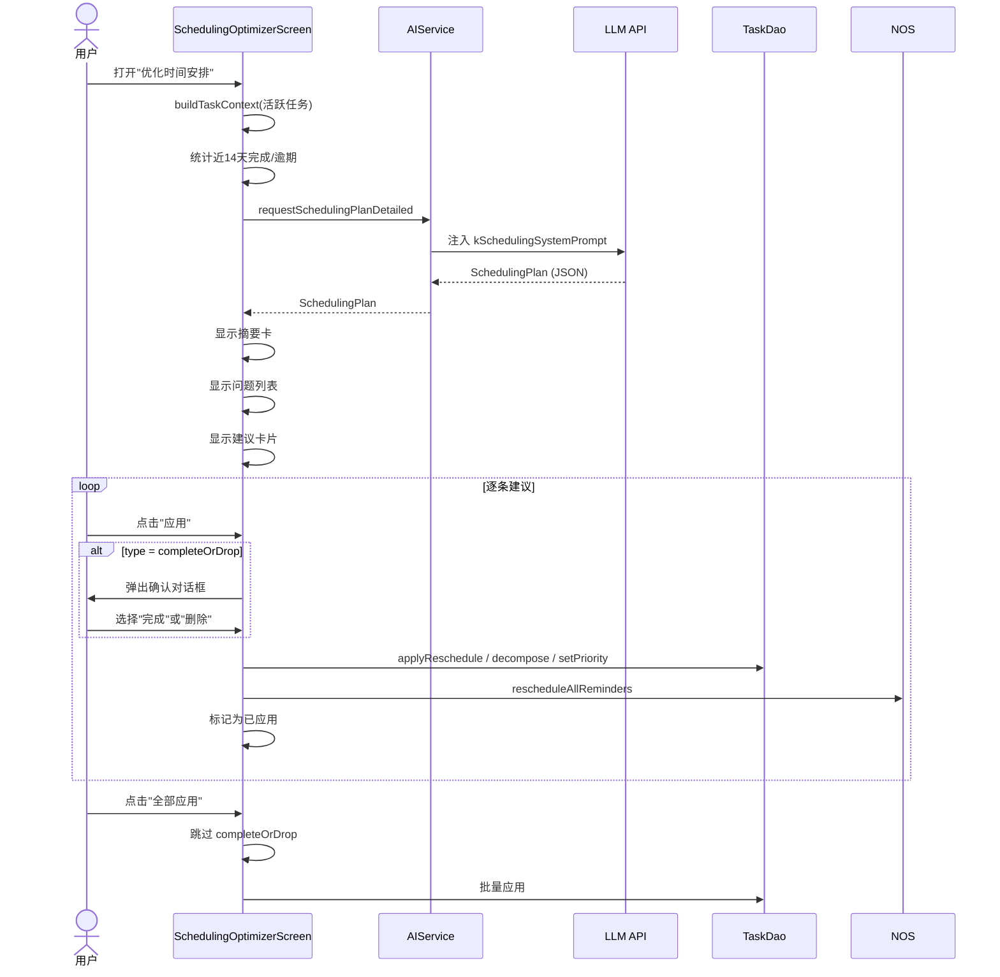
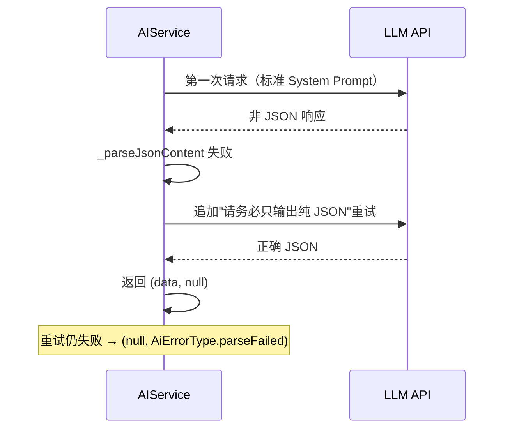

# Catodo AI Agent 交互流程

## 1. 用户发送消息 → Agent 响应

```mermaid
sequenceDiagram
    actor User as 用户
    participant UI as ChatScreen
    participant S as AIService
    participant AIA as AI Agent
    participant DAO as TaskDao
    participant LLM as LLM API

    User->>UI: 输入消息
    UI->>UI: 检查 AI Service 就绪
    UI->>UI: buildTaskContext(tasks)
    UI->>UI: messagesToTurns(history)
    UI->>UI: 添加隐式指令<br/>（禁止重复操作）
    UI->>S: requestAgentActionDetailedWithHistory
    S->>LLM: POST /chat/completions
    LLM-->>S: {reply, actions[]}

    alt 解析失败 (parseFailed)
        S->>LLM: 重试 1 次（追加 JSON 提示）
        LLM-->>S: 重试结果
    end

    S-->>UI: AgentResponse

    UI->>UI: 拆分 actions
    UI->>UI: 提取 query_tasks

    loop 每个自动 action
        UI->>AIA: executeAction(action, dao)
        AIA->>DAO: Task 操作
        DAO-->>AIA: ActionResult
        AIA-->>UI: ActionResult
    end

    UI->>UI: 拼接回复 + 执行结果
    UI->>UI: _appendDb(assistant)

    alt 有待确认 actions
        UI->>UI: 显示确认卡片
        User->>UI: 点击确认
        UI->>AIA: executeAction(action, dao)
        AIA->>DAO: Task 操作
        UI->>NOS: rescheduleAllReminders
    end

    UI-->>User: 显示回复气泡
```

## 2. 时间安排优化助手

```mermaid
sequenceDiagram
    actor User as 用户
    participant UI as SchedulingOptimizerScreen
    participant S as AIService
    participant LLM as LLM API
    participant DAO as TaskDao

    User->>UI: 打开"优化时间安排"
    UI->>UI: buildTaskContext(活跃任务)
    UI->>UI: 统计近14天完成/逾期
    UI->>S: requestSchedulingPlanDetailed
    S->>LLM: 注入 kSchedulingSystemPrompt
    LLM-->>S: SchedulingPlan (JSON)
    S-->>UI: SchedulingPlan

    UI->>UI: 显示摘要卡
    UI->>UI: 显示问题列表
    UI->>UI: 显示建议卡片

    loop 逐条建议
        User->>UI: 点击"应用"
        alt type = completeOrDrop
            UI->>User: 弹出确认对话框
            User->>UI: 选择"完成"或"删除"
        end
        UI->>DAO: applyReschedule / decompose / setPriority
        UI->>NOS: rescheduleAllReminders
        UI->>UI: 标记为已应用
    end

    User->>UI: 点击"全部应用"
    UI->>UI: 跳过 completeOrDrop
    UI->>DAO: 批量应用
```

## 3. JSON 解析自动重试

```mermaid
sequenceDiagram
    participant S as AIService
    participant LLM as LLM API

    S->>LLM: 第一次请求（标准 System Prompt）
    LLM-->>S: 非 JSON 响应
    S->>S: _parseJsonContent 失败
    S->>LLM: 追加"请务必只输出纯 JSON"重试
    LLM-->>S: 正确 JSON
    S->>S: 返回 (data, null)
    Note over S: 重试仍失败 → (null, AiErrorType.parseFailed)
```
