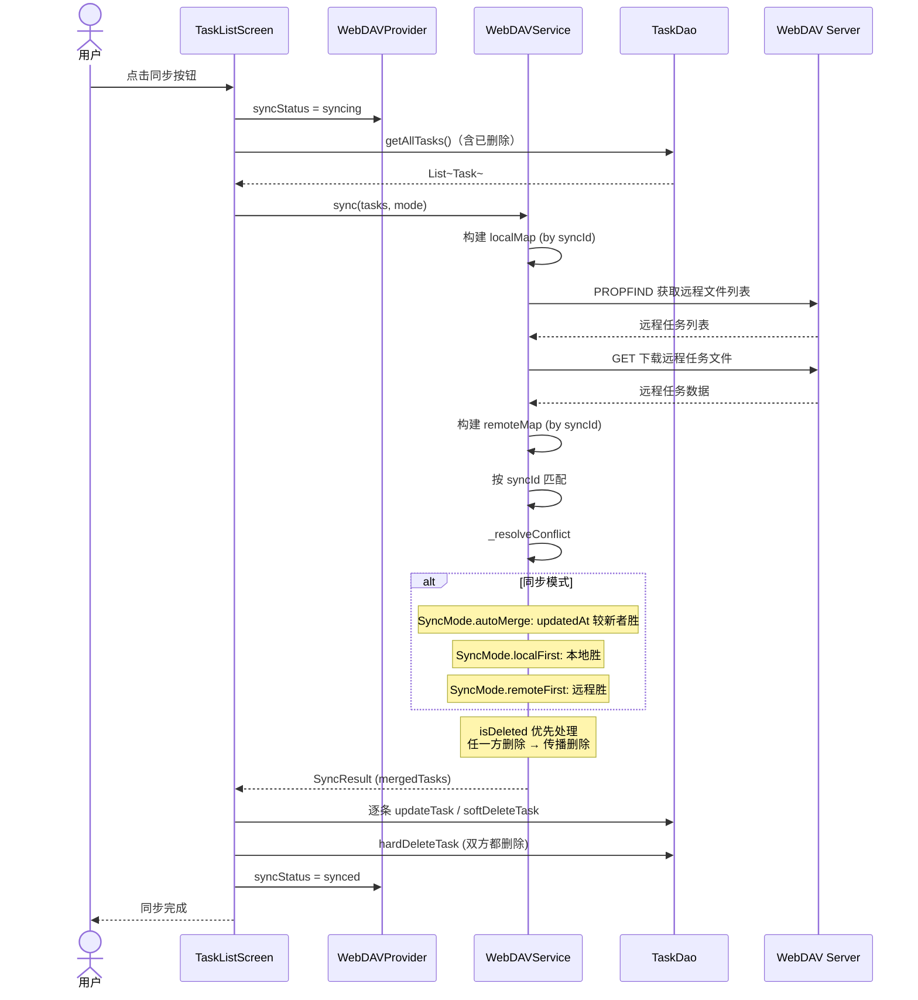
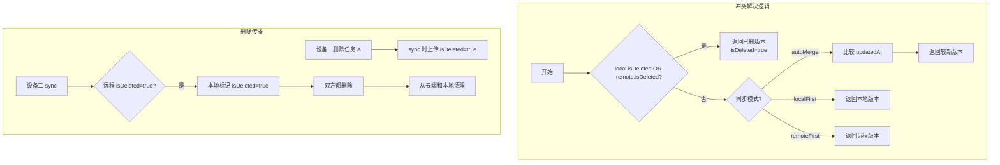
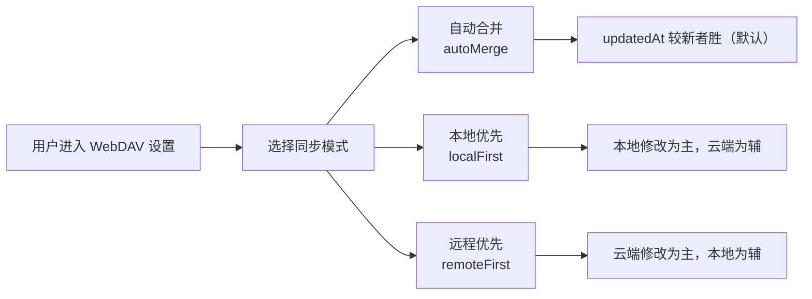

# Catodo WebDAV 同步流程

```mermaid
sequenceDiagram
    actor User as 用户
    participant UI as TaskListScreen
    participant P as WebDAVProvider
    participant S as WebDAVService
    participant DAO as TaskDao
    participant CLOUD as WebDAV Server

    User->>UI: 点击同步按钮
    UI->>P: syncStatus = syncing
    UI->>DAO: getAllTasks()（含已删除）
    DAO-->>UI: List~Task~
    UI->>S: sync(tasks, mode)
    S->>S: 构建 localMap (by syncId)
    S->>CLOUD: PROPFIND 获取远程文件列表
    CLOUD-->>S: 远程任务列表
    S->>CLOUD: GET 下载远程任务文件
    CLOUD-->>S: 远程任务数据
    S->>S: 构建 remoteMap (by syncId)
    S->>S: 按 syncId 匹配
    S->>S: _resolveConflict

    alt 同步模式
        Note over S: SyncMode.autoMerge: updatedAt 较新者胜
        Note over S: SyncMode.localFirst: 本地胜
        Note over S: SyncMode.remoteFirst: 远程胜
    end

    Note over S: isDeleted 优先处理<br/>任一方删除 → 传播删除

    S-->>UI: SyncResult (mergedTasks)
    UI->>DAO: 逐条 updateTask / softDeleteTask
    UI->>DAO: hardDeleteTask (双方都删除)
    UI->>P: syncStatus = synced
    UI-->>User: 同步完成
```

```mermaid
graph TD
    subgraph 冲突解决逻辑
        A[开始] --> B{local.isDeleted OR remote.isDeleted?}
        B -->|是| C[返回已删版本<br/>isDeleted=true]
        B -->|否| D{同步模式?}
        D -->|autoMerge| E[比较 updatedAt]
        E --> F[返回较新版本]
        D -->|localFirst| G[返回本地版本]
        D -->|remoteFirst| H[返回远程版本]
    end

    subgraph 删除传播
        I[设备一删除任务 A] --> J[sync 时上传 isDeleted=true]
        K[设备二 sync] --> L{远程 isDeleted=true?}
        L -->|是| M[本地标记 isDeleted=true]
        M --> N[双方都删除]
        N --> O[从云端和本地清理]
    end
```

## 同步模式选择界面对话框（用户设置）

```mermaid
graph LR
    A[用户进入 WebDAV 设置]
    B[选择同步模式]
    C[自动合并<br/>autoMerge]
    D[本地优先<br/>localFirst]
    E[远程优先<br/>remoteFirst]

    A --> B
    B --> C
    B --> D
    B --> E

    C --> F["updatedAt 较新者胜（默认）"]
    D --> G["本地修改为主，云端为辅"]
    E --> H["云端修改为主，本地为辅"]
```
