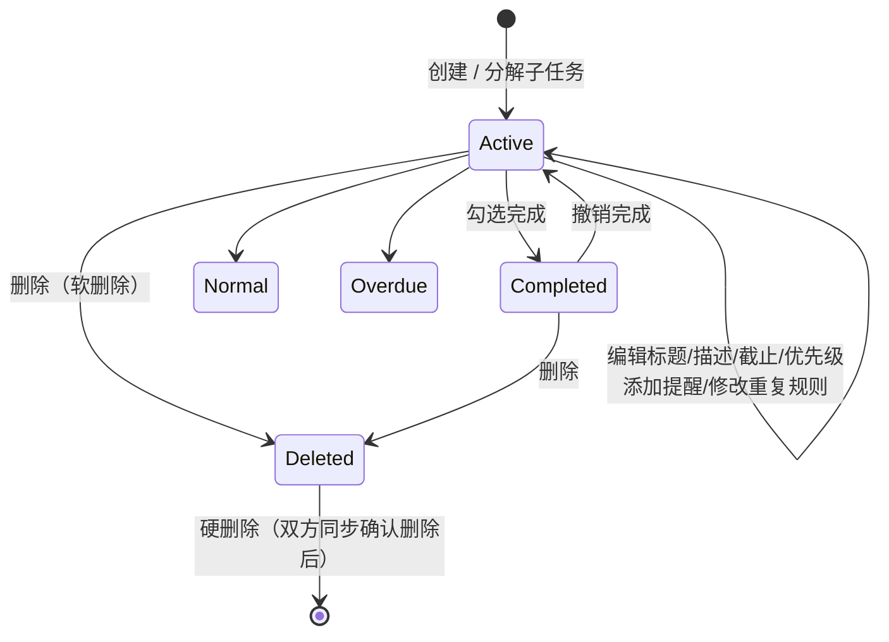
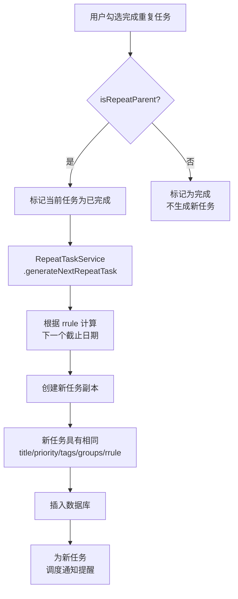
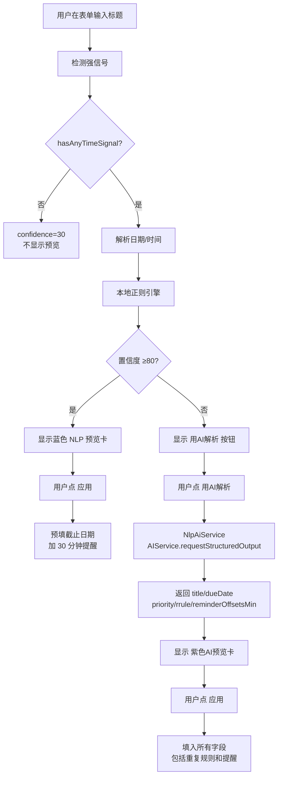
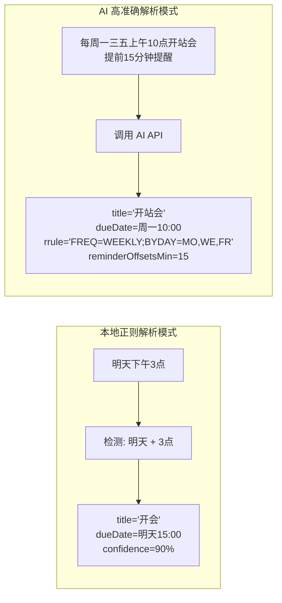

# Catodo 任务生命周期图

## 1. 任务状态机

```mermaid
stateDiagram-v2
    [*] --> Active : 创建 / 分解子任务
    Active --> Completed : 勾选完成
    Active --> Deleted : 删除（软删除）
    Active --> Active : 编辑标题/描述/截止/优先级<br/>添加提醒/修改重复规则
    Completed --> Active : 撤销完成
    Completed --> Deleted : 删除
    Deleted --> [*] : 硬删除（双方同步确认删除后）

    state Normal : 未过期（有未来截止或无截止日期）
    state Overdue : 已逾期
    Active --> Normal
    Active --> Overdue
```

## 2. 重复任务生成流程

```mermaid
flowchart TD
    A[用户勾选完成重复任务] --> B{isRepeatParent?}
    B -->|是| C[标记当前任务为已完成]
    B -->|否| E[标记为完成<br/>不生成新任务]
    C --> D[RepeatTaskService<br/>.generateNextRepeatTask]
    D --> F[根据 rrule 计算<br/>下一个截止日期]
    F --> G[创建新任务副本]
    G --> H[新任务具有相同<br/>title/priority/tags/groups/rrule]
    H --> I[插入数据库]
    I --> J[为新任务<br/>调度通知提醒]
```

## 3. NLP 智能解析流程

```mermaid
flowchart TD
    A[用户在表单输入标题] --> B[检测强信号]
    B --> C{hasAnyTimeSignal?}
    C -->|否| D[confidence=30<br/>不显示预览]
    C -->|是| E[解析日期/时间]
    
    E --> F[本地正则引擎]
    F --> G{置信度 ≥80?}
    G -->|是| H[显示蓝色 NLP 预览卡]
    G -->|否| I["显示 用AI解析 按钮"]

    H --> J["用户点 应用"]
    J --> K[预填截止日期<br/>加 30 分钟提醒]

    I --> L["用户点 用AI解析"]
    L --> M[NlpAiService<br/>AIService.requestStructuredOutput]
    M --> N["返回 title/dueDate<br/>priority/rrule/reminderOffsetsMin"]
    N --> O["显示 紫色AI预览卡"]
    O --> P["用户点 应用"]
    P --> Q[填入所有字段<br/>包括重复规则和提醒]
```

```mermaid
flowchart LR
    subgraph 本地正则解析模式
        A1[明天下午3点] --> B1[检测: 明天 + 3点]
        B1 --> C1["title='开会'<br/>dueDate=明天15:00<br/>confidence=90%"]
    end

    subgraph AI 高准确解析模式
        A2[每周一三五上午10点开站会<br/>提前15分钟提醒] --> B2[调用 AI API]
        B2 --> C2["title='开站会'<br/>dueDate=周一10:00<br/>rrule='FREQ=WEEKLY;BYDAY=MO,WE,FR'<br/>reminderOffsetsMin=15"]
    end
```
