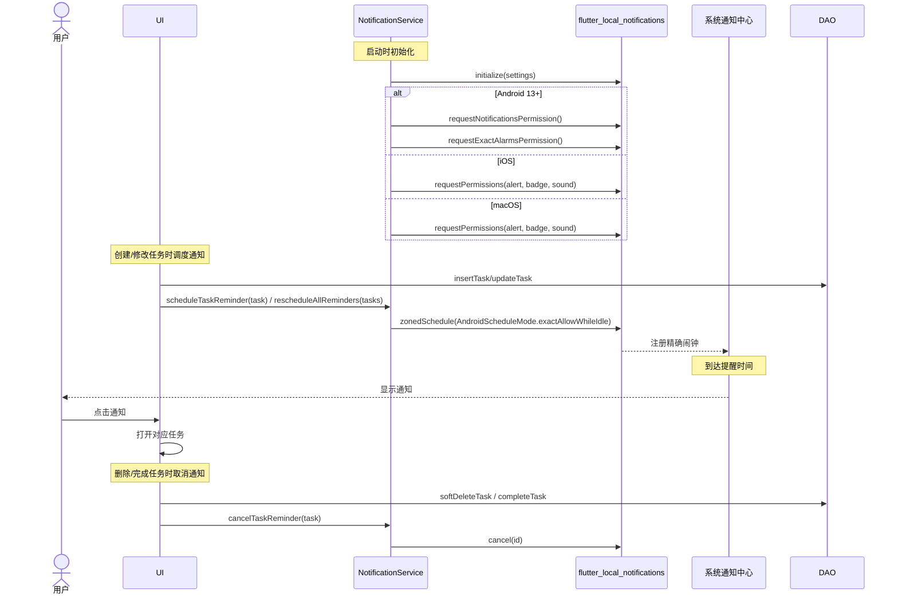
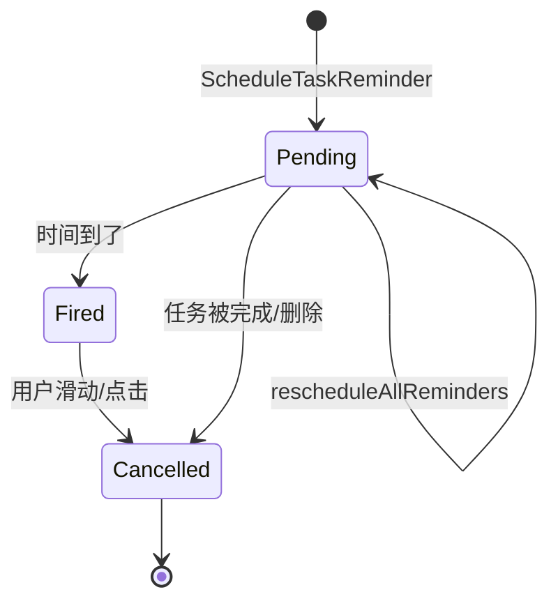
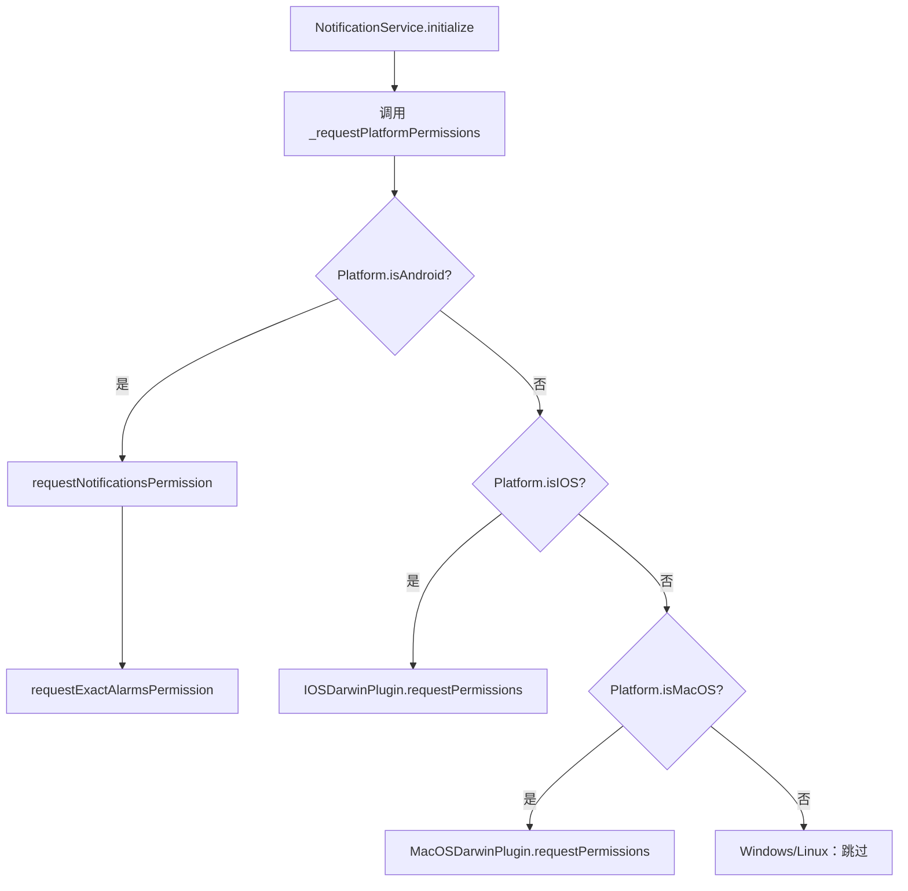

# Catodo 通知系统流程

```mermaid
sequenceDiagram
    actor User as 用户
    participant UI as UI
    participant NOS as NotificationService
    participant FLN as flutter_local_notifications
    participant OS as 系统通知中心

    Note over NOS: 启动时初始化
    NOS->>FLN: initialize(settings)
    alt Android 13+
        NOS->>FLN: requestNotificationsPermission()
        NOS->>FLN: requestExactAlarmsPermission()
    else iOS
        NOS->>FLN: requestPermissions(alert, badge, sound)
    else macOS
        NOS->>FLN: requestPermissions(alert, badge, sound)
    end

    Note over UI: 创建/修改任务时调度通知
    UI->>DAO: insertTask/updateTask
    UI->>NOS: scheduleTaskReminder(task) / rescheduleAllReminders(tasks)
    NOS->>FLN: zonedSchedule(AndroidScheduleMode.exactAllowWhileIdle)
    FLN-->>OS: 注册精确闹钟

    Note over OS: 到达提醒时间
    OS-->>User: 显示通知
    User->>UI: 点击通知
    UI->>UI: 打开对应任务

    Note over UI: 删除/完成任务时取消通知
    UI->>DAO: softDeleteTask / completeTask
    UI->>NOS: cancelTaskReminder(task)
    NOS->>FLN: cancel(id)
```

```mermaid
stateDiagram-v2
    [*] --> Pending: ScheduleTaskReminder
    Pending --> Fired: 时间到了
    Fired --> Cancelled: 用户滑动/点击
    Pending --> Cancelled: 任务被完成/删除
    Pending --> Pending: rescheduleAllReminders
    Cancelled --> [*]
```

## 通知权限按平台分流

```mermaid
graph TD
    A[NotificationService.initialize] --> B[调用 _requestPlatformPermissions]
    B --> C{Platform.isAndroid?}
    C -->|是| D[requestNotificationsPermission]
    D --> E[requestExactAlarmsPermission]
    C -->|否| F{Platform.isIOS?}
    F -->|是| G[IOSDarwinPlugin.requestPermissions]
    F -->|否| H{Platform.isMacOS?}
    H -->|是| I[MacOSDarwinPlugin.requestPermissions]
    H -->|否| J[Windows/Linux：跳过]
```
