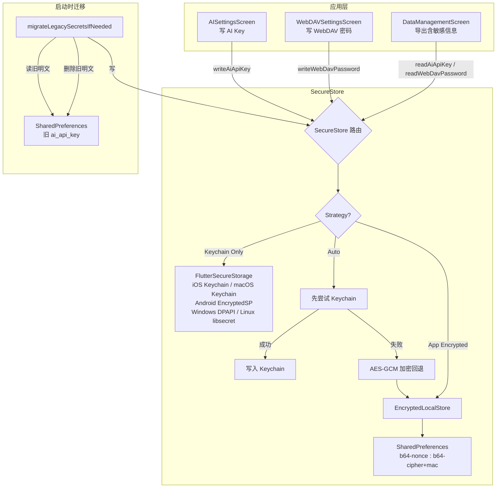
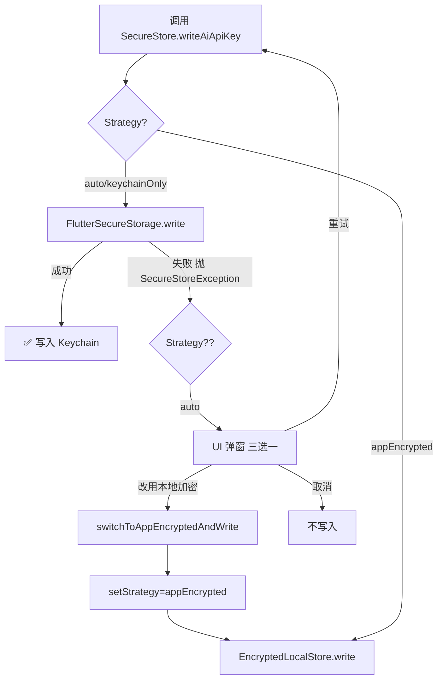
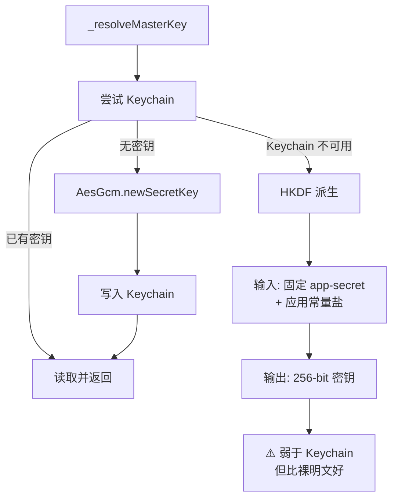

# Catodo 安全存储架构

```mermaid
graph TD
    subgraph 应用层
        A[AISettingsScreen<br/>写 AI Key]
        B[WebDAVSettingsScreen<br/>写 WebDAV 密码]
        C[DataManagementScreen<br/>导出含敏感信息]
    end

    subgraph SecureStore
        D{SecureStore 路由}
        D --> E{Strategy?}
        E -->|Keychain Only| F[FlutterSecureStorage<br/>iOS Keychain / macOS Keychain<br/>Android EncryptedSP<br/>Windows DPAPI / Linux libsecret]
        E -->|Auto| G[先尝试 Keychain]
        G -->|成功| H[写入 Keychain]
        G -->|失败| I[AES-GCM 加密回退]
        I --> J[EncryptedLocalStore]
        J --> K["SharedPreferences<br/>b64-nonce : b64-cipher+mac"]
        E -->|App Encrypted| J
    end

    A -->|writeAiApiKey| D
    B -->|writeWebDavPassword| D
    C -->|readAiApiKey / readWebDavPassword| D

    subgraph 启动时迁移
        L[migrateLegacySecretsIfNeeded]
        L -->|读旧明文| M[SharedPreferences<br/>旧 ai_api_key]
        L -->|写| D
        L -->|删除旧明文| M
    end
```

## SecureStore Tier-fallback 三层结构

```mermaid
flowchart TD
    A[调用 SecureStore.writeAiApiKey] --> B{Strategy?}
    B -->|auto/keychainOnly| C[FlutterSecureStorage.write]
    C -->|成功| D[✅ 写入 Keychain]
    C -->|失败 抛 SecureStoreException| E{Strategy??}
    E -->|auto| F[UI 弹窗 三选一]
    F -->|重试| A
    F -->|改用本地加密| G[switchToAppEncryptedAndWrite]
    G --> H[setStrategy=appEncrypted]
    H --> I[EncryptedLocalStore.write]
    F -->|取消| J[不写入]
    B -->|appEncrypted| I
```

## 主密钥派生

```mermaid
flowchart TD
    A[_resolveMasterKey] --> B[尝试 Keychain]
    B -->|已有密钥| C[读取并返回]
    B -->|无密钥| D[AesGcm.newSecretKey]
    D --> E[写入 Keychain]
    E --> C
    B -->|Keychain 不可用| F[HKDF 派生]
    F --> G[输入: 固定 app-secret<br/>+ 应用常量盐]
    G --> H[输出: 256-bit 密钥]
    H --> I[⚠️ 弱于 Keychain<br/>但比裸明文好]
```
