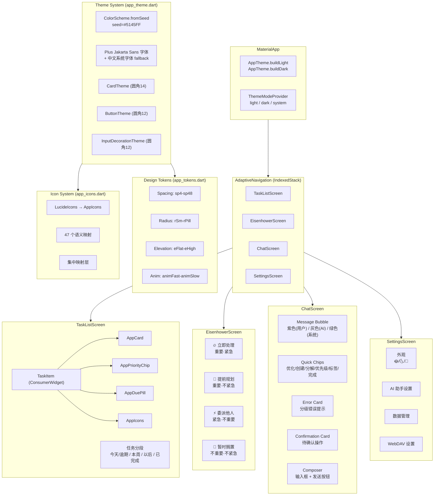
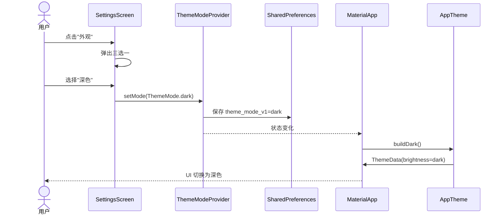

# Catodo UI 组件树与主题体系

```mermaid
graph TD
    subgraph App["MaterialApp"]
        theme[AppTheme.buildLight<br/>AppTheme.buildDark]
        TM[ThemeModeProvider<br/>light / dark / system]
    end

    subgraph Navigation["AdaptiveNavigation (IndexedStack)"]
        TS[TaskListScreen]
        ES[EisenhowerScreen]
        CS[ChatScreen]
        SS[SettingsScreen]
    end

    subgraph TaskList["TaskListScreen"]
        TI["TaskItem (ConsumerWidget)"]
        TI --> AC["AppCard"]
        TI --> APC["AppPriorityChip"]
        TI --> ADP["AppDuePill"]
        TI --> AIcon["AppIcons"]
        TL["任务分段<br/>今天/逾期 / 本周 / 以后 / 已完成"]
    end

    subgraph Eisenhower["EisenhowerScreen"]
        Q1["🔥 立即处理<br/>重要·紧急"]
        Q2["🎯 提前规划<br/>重要·不紧急"]
        Q3["⚡ 委派他人<br/>紧急·不重要"]
        Q4["🌿 暂时搁置<br/>不重要·不紧急"]
    end

    subgraph Chat["ChatScreen"]
        MB["Message Bubble<br/>紫色(用户) / 灰色(AI) / 绿色(系统)"]
        QB["Quick Chips<br/>优化/创建/分解/优先级/标签/完成"]
        EC["Error Card<br/>分级错误提示"]
        CC["Confirmation Card<br/>待确认操作"]
        CB["Composer<br/>输入框 + 发送按钮"]
    end

    subgraph Settings["SettingsScreen"]
        UI["外观<br/>🌞/🌜/🔄"]
        AI["AI 助手设置"]
        DM["数据管理"]
        WD["WebDAV 设置"]
    end

    App --> Navigation
    Navigation --> TaskList
    Navigation --> Eisenhower
    Navigation --> Chat
    Navigation --> Settings

    subgraph Theme["Theme System (app_theme.dart)"]
        CS1["ColorScheme.fromSeed<br/>seed=#5145FF"]
        CS2["Plus Jakarta Sans 字体<br/>+ 中文系统字体 fallback"]
        CS3["CardTheme (圆角14)"]
        CS4["ButtonTheme (圆角12)"]
        CS5["InputDecorationTheme (圆角12)"]
    end

    subgraph Tokens["Design Tokens (app_tokens.dart)"]
        T1["Spacing: sp4-sp48"]
        T2["Radius: rSm-rPill"]
        T3["Elevation: eFlat-eHigh"]
        T4["Anim: animFast-animSlow"]
    end

    subgraph Icons["Icon System (app_icons.dart)"]
        I1["LucideIcons → AppIcons"]
        I2["47 个语义映射"]
        I3["集中映射层"]
    end

    Theme --> Tokens
    Theme --> Icons
```

## 主题切换流程

```mermaid
sequenceDiagram
    actor User as 用户
    participant SS as SettingsScreen
    participant TP as ThemeModeProvider
    participant SP as SharedPreferences
    participant MA as MaterialApp
    participant AT as AppTheme

    User->>SS: 点击"外观"
    SS->>SS: 弹出三选一
    User->>SS: 选择"深色"
    SS->>TP: setMode(ThemeMode.dark)
    TP->>SP: 保存 theme_mode_v1=dark
    TP-->>MA: 状态变化
    MA->>AT: buildDark()
    AT->>MA: ThemeData(brightness=dark)
    MA-->>User: UI 切换为深色
```
