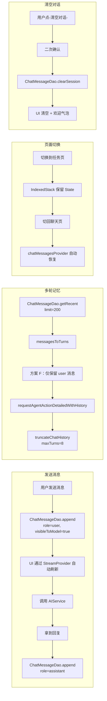
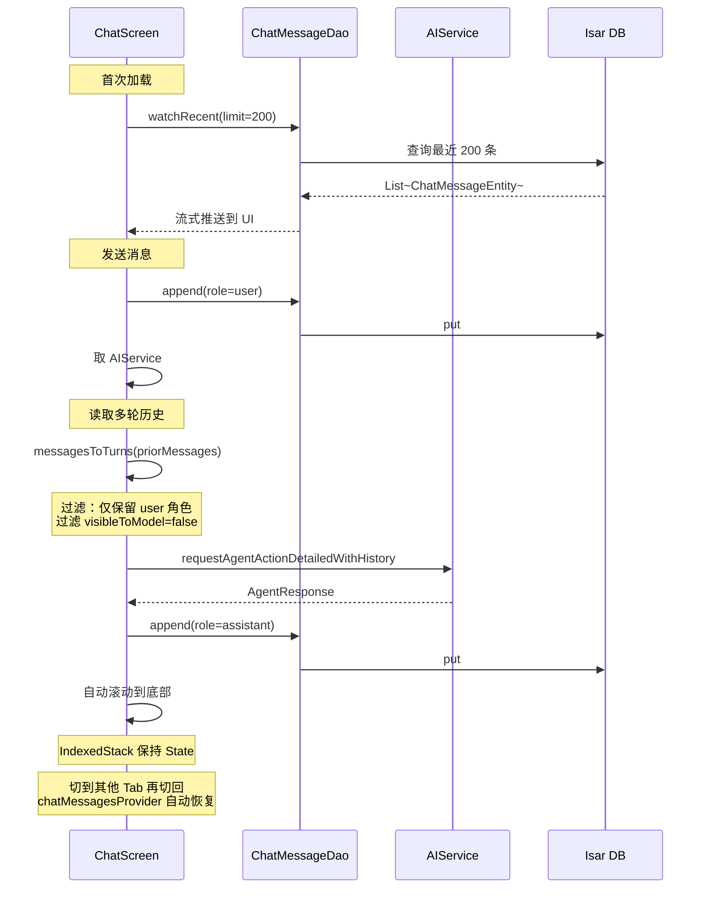

# Catodo 聊天历史持久化流程

```mermaid
flowchart LR
    subgraph 发送消息
        A[用户发送消息] --> B[ChatMessageDao.append<br/>role=user, visibleToModel=true]
        B --> C[UI 通过 StreamProvider 自动刷新]
        C --> D[调用 AIService]
        D --> E[拿到回复]
        E --> F[ChatMessageDao.append<br/>role=assistant]
    end

    subgraph 多轮记忆
        G[ChatMessageDao.getRecent<br/>limit=200] --> H[messagesToTurns]
        H --> I["方案 F：仅保留 user 消息"]
        I --> J[requestAgentActionDetailedWithHistory]
        J --> K[truncateChatHistory<br/>maxTurns=8]
    end

    subgraph 页面切换
        L[切换到任务页] --> M[IndexedStack 保留 State]
        M --> N[切回聊天页]
        N --> O[chatMessagesProvider 自动恢复]
    end

    subgraph 清空对话
        P[用户点-清空对话-] --> Q[二次确认]
        Q --> R[ChatMessageDao.clearSession]
        R --> S[UI 清空 + 欢迎气泡]
    end
```

```mermaid
sequenceDiagram
    participant UI as ChatScreen
    participant P as ChatMessageDao
    participant S as AIService
    participant DB as Isar DB

    Note over UI: 首次加载
    UI->>P: watchRecent(limit=200)
    P->>DB: 查询最近 200 条
    DB-->>P: List~ChatMessageEntity~
    P-->>UI: 流式推送到 UI

    Note over UI: 发送消息
    UI->>P: append(role=user)
    P->>DB: put
    UI->>UI: 取 AIService

    Note over UI: 读取多轮历史
    UI->>UI: messagesToTurns(priorMessages)
    Note over UI: 过滤：仅保留 user 角色<br/>过滤 visibleToModel=false

    UI->>S: requestAgentActionDetailedWithHistory
    S-->>UI: AgentResponse

    UI->>P: append(role=assistant)
    P->>DB: put
    UI->>UI: 自动滚动到底部

    Note over UI: IndexedStack 保持 State
    Note over UI: 切到其他 Tab 再切回<br/>chatMessagesProvider 自动恢复
```
