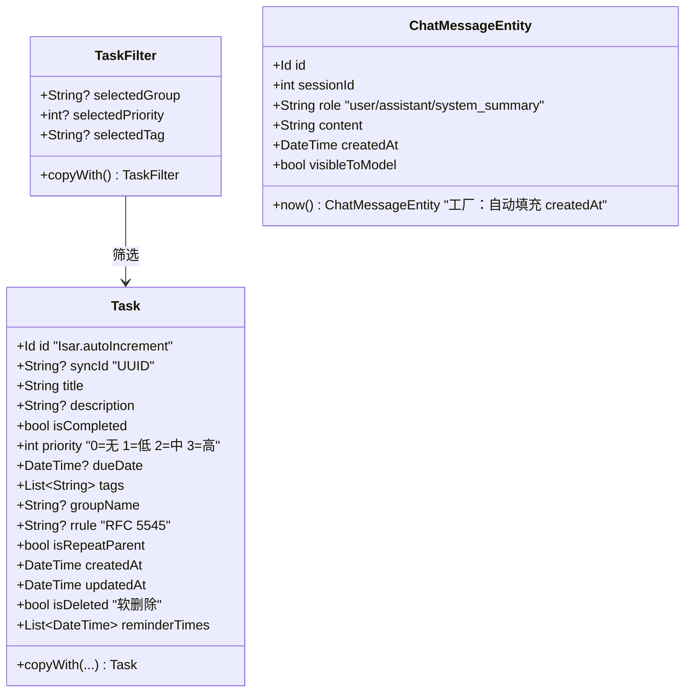
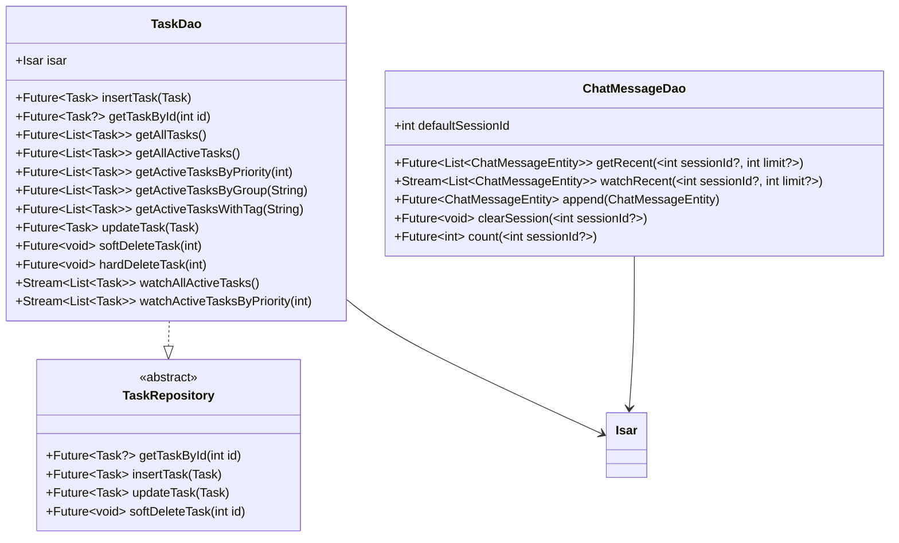

# Catodo 完整类图

## 模型层 (lib/models/)

```mermaid
classDiagram
    class Task {
        +Id id  "Isar.autoIncrement"
        +String? syncId  "UUID"
        +String title
        +String? description
        +bool isCompleted
        +int priority  "0=无 1=低 2=中 3=高"
        +DateTime? dueDate
        +List~String~ tags
        +String? groupName
        +String? rrule  "RFC 5545"
        +bool isRepeatParent
        +DateTime createdAt
        +DateTime updatedAt
        +bool isDeleted  "软删除"
        +List~DateTime~ reminderTimes
        +copyWith(...) Task
    }

    class TaskFilter {
        +String? selectedGroup
        +int? selectedPriority
        +String? selectedTag
        +copyWith() TaskFilter
    }

    class ChatMessageEntity {
        +Id id
        +int sessionId
        +String role  "user/assistant/system_summary"
        +String content
        +DateTime createdAt
        +bool visibleToModel
        +now() ChatMessageEntity  "工厂：自动填充 createdAt"
    }

    TaskFilter --> Task : 筛选
```

## 数据访问层 (lib/data/)

```mermaid
classDiagram
    class TaskRepository {
        <<abstract>>
        +Future~Task?~ getTaskById(int id)
        +Future~Task~ insertTask(Task)
        +Future~Task~ updateTask(Task)
        +Future~void~ softDeleteTask(int id)
    }

    class TaskDao {
        +Isar isar
        +Future~Task~ insertTask(Task)
        +Future~Task?~ getTaskById(int id)
        +Future~List~Task~~ getAllTasks()
        +Future~List~Task~~ getAllActiveTasks()
        +Future~List~Task~~ getActiveTasksByPriority(int)
        +Future~List~Task~~ getActiveTasksByGroup(String)
        +Future~List~Task~~ getActiveTasksWithTag(String)
        +Future~Task~ updateTask(Task)
        +Future~void~ softDeleteTask(int)
        +Future~void~ hardDeleteTask(int)
        +Stream~List~Task~~ watchAllActiveTasks()
        +Stream~List~Task~~ watchActiveTasksByPriority(int)
    }

    class ChatMessageDao {
        +int defaultSessionId
        +Future~List~ChatMessageEntity~~ getRecent(~int sessionId?, int limit?~)
        +Stream~List~ChatMessageEntity~~ watchRecent(~int sessionId?, int limit?~)
        +Future~ChatMessageEntity~ append(ChatMessageEntity)
        +Future~void~ clearSession(~int sessionId?~)
        +Future~int~ count(~int sessionId?~)
    }

    TaskDao ..|> TaskRepository
    TaskDao --> Isar
    ChatMessageDao --> Isar
```

## 服务层 (lib/services/)

```mermaid
classDiagram
    class AIService {
        +AIConfig config
        +requestStructuredOutput(system, user, history) Map?
        +requestStructuredOutputDetailed(system, user, history) (data, error)
        +requestAgentAction(user, context) AgentResponse
        +requestAgentActionWithHistory(history, latest, context) AgentResponse
        +requestAgentActionDetailedWithHistory() (response, error)
        +requestSchedulingPlanDetailed(context, extraNote) (plan, error)
        +testConnection() ConnectionTestResult
        +fetchModels() List~String~
        +decomposeTask(String) List~Map~?
        +getOverdueSupport(String, DateTime) String?
    }

    class AIConfig {
        +String providerId
        +String apiKey
        +String apiUrl
        +String modelName
        +bool isValid
        +LLMProvider provider
    }

    class AiCallError {
        +AiErrorType type
        +String message
        +String? detail
        +int? statusCode
    }

    class AiErrorType {
        <<enum>>
        unauthorized
        forbidden
        notFound
        badRequest
        rateLimited
        serverError
        network
        timeout
        parseFailed
        unknown
    }

    class ChatTurn {
        +String role  "user | assistant"
        +String content
        +.user(content) ChatTurn
        +.assistant(content) ChatTurn
        +toJson() Map
    }

    class ConnectionTestResult {
        +bool success
        +String message
        +String? detail
    }

    class AgentActionType {
        <<enum>> 15种
        createTask
        updateTask
        completeTask / uncompleteTask
        deleteTask
        decomposeTask
        addTag / removeTag
        setGroup / setPriority
        addReminder / removeReminder / clearReminders
        setRepeat / clearRepeat
        queryTasks
        bulkUpdate
    }

    class AgentAction {
        +AgentActionType type
        +Map~String, dynamic~ params
        +bool needsConfirmation
        +String description
        +tryFromJson(Map) AgentAction?
    }

    class AgentResponse {
        +String reply
        +List~AgentAction~ actions
        +List~String~ warnings
    }

    class ActionResult {
        +bool success
        +String message
        +dynamic data
    }

    class SchedulingPlan {
        +String summary
        +List~SchedulingIssue~ issues
        +List~SchedulingSuggestion~ suggestions
        +List~String~ warnings
    }

    class SchedulingSuggestion {
        +String id
        +SchedulingSuggestionType type
        +int? taskId
        +DateTime? newDueDate
        +int? priority
        +List~Map~? subtasks
        +List~DateTime~? reminderTimes
        +String reason
        +String title  "getter"
    }

    class SchedulingIssue {
        +String type
        +String? date
        +List~int~ taskIds
        +String note
    }

    class LLMProvider {
        +String id
        +String name
        +String apiUrl
        +String defaultModel
        +String description
        +double defaultTemperature
    }

    class LLMProviderRegistry {
        +List~LLMProvider~ providers
        +getById(String) LLMProvider
    }

    class SecureStore {
        +readAiApiKey() String?
        +writeAiApiKey(String)
        +deleteAiApiKey()
        +readWebDavPassword() String?
        +writeWebDavPassword(String)
        +deleteWebDavPassword()
        +currentStrategy() SecureStoreStrategy
        +setStrategy(SecureStoreStrategy)
        +switchToAppEncryptedAndWrite(String, String)
        +overrideForTest(storage)  "测试"
        +resetForTest()
    }

    class SecureStoreException {
        +String operation
        +String key
        +Object cause
        +String tier  "keychain | encrypted"
    }

    class SecureStoreStrategy {
        <<enum>>
        auto
        keychainOnly
        appEncrypted
    }

    class EncryptedLocalStore {
        +read(String) String?
        +write(String, String)
        +delete(String)
    }

    class WebDAVConfig {
        +String url
        +String username
        +String password
        +isValid() bool  "getter: url+username+password 非空"
    }

    class SyncResult {
        +SyncStatus status
        +int uploadedCount
        +int downloadedCount
        +List~Task~ mergedTasks  "非空，默认[]"
        +String? error
    }

    class SyncStatus {
        <<enum>>
        idle
        syncing
        synced
        failed
    }

    class SyncMode {
        <<enum>>
        autoMerge
        localFirst
        remoteFirst
    }

    class WebDAVService {
        +WebDAVConfig config
        +testConnection() bool
        +sync(tasks, mode) SyncResult
        +downloadTasks() List~Task~
        +resolveConflictTest(local, remote, mode) Task  "测试用"
    }

    class NlpService {
        +parseNaturalLanguage(String) ParsedTask
        +hasAnyTimeSignal(String) bool
    }

    class ParsedTask {
        +String title
        +DateTime? dueDate
        +int confidence
    }

    class NlpAiService {
        +AIService aiService
        +parse(String, now?) AiParsedTask
        +fromJsonForTest(map, fallbackTitle) AiParsedTask  "测试"
    }

    class AiParsedTask {
        +String title
        +DateTime? dueDate
        +int? priority
        +String? rrule
        +List~int~? reminderOffsetsMin
    }

    class NotificationService {
        +initialize()
        +scheduleTaskReminder(Task)
        +cancelTaskReminder(Task)
        +showNotification(int, String, String)
        +rescheduleAllReminders(List~Task~)
    }

    class RepeatTaskService {
        +generateNextRepeatTask(Task) Task?
    }

    class DatabaseService {
        +getInstance() Isar
        +close()
    }

    class CatodoIOService {
        +exportCatodo(tasks, settings, includeSensitive) String
        +importCatodo(String) CatodoExportData
        +validateVersion(String) bool
    }

    class CatodoExportData {
        +String version
        +String exportedAt
        +List~Task~ tasks
        +Map~String, dynamic~ settings
    }

    AIService --> AIConfig
    AIService --> AgentResponse
    AIService --> ChatTurn
    NlpAiService --> AIService
    SecureStore --> EncryptedLocalStore
    EncryptedLocalStore --> SharedPreferences
```

## Provider 层 (lib/providers/)

```mermaid
classDiagram
    class isarProvider {
        +FutureProvider~Isar~
    }

    class filteredTasksProvider {
        +Provider~List~Task~~
    }

    class chatMessagesProvider {
        +StreamProvider~List~ChatMessageEntity~~
    }

    class chatMessageDaoProvider {
        +Provider~ChatMessageDao~
    }

    class aiServiceProvider {
        +FutureProvider~AIService?~
    }

    class themeModeProvider {
        +StateNotifierProvider~ThemeModeNotifier, ThemeMode~
    }

    class webdavConfigProvider {
        +StateNotifierProvider~WebDAVConfigNotifier, WebDAVConfig~
    }

    class syncStatusProvider {
        +StateProvider~SyncStatus~
    }

    class syncModeProvider {
        +StateNotifierProvider~SyncModeNotifier, SyncMode~
    }

    class chatInitialMessageProvider {
        +StateProvider~String?~
    }

    class selectedTabProvider {
        +StateProvider~int~
    }

    class DayViewMode {
        <<enum>>
        all
        focusToday
        hideOverdue
    }

    class ThemeModeNotifier {
        +setMode(ThemeMode)
    }

    class WebDAVConfigNotifier {
        +saveConfig(WebDAVConfig)
        +testConnection() bool
    }

    class SyncModeNotifier {
        +setMode(SyncMode)
    }
```

## UI 组件层 (lib/ui/)

```mermaid
classDiagram
    class AppTheme {
        <<utility>>
        +Color seed  "#5145FF"
        +String fontFamily  "PlusJakartaSans"
        +List~String~ fontFamilyFallback  "PingFang/Microsoft YaHei/Noto CJK"
        +buildLight() ThemeData
        +buildDark() ThemeData
    }

    class AppTokens {
        <<utility>>
        +sp4 ~ sp48  "间距 4/8 倍数"
        +rSm ~ rPill  "圆角 8/12/14/20/999"
        +eFlat ~ eHigh  "elevation 0/1/2/4"
        +animFast ~ animSlow  "150/250/500ms"
    }

    class AppSemanticColors {
        <<utility>>
        +Color priorityHigh / Mid / Low / None
        +Color success / warning / overdue
        +forPriority(int) Color
        +labelForPriority(int) String
    }

    class AppIcons {
        <<utility>>
        +LucideIcons settings / grid / list / chat
        +LucideIcons flag / calendar / clock / repeat
        +LucideIcons send / sparkle / magic / bot
        +LucideIcons warning / error / lock / wifi
        +... 共~47~个映射
    }

    class AppCard {
        +Widget child
        +VoidCallback? onTap
        +EdgeInsets padding  "默认 sp16"
        +Color? color
        +Color? borderColor
        +BorderRadiusGeometry? borderRadius  "默认 rLg(14)"
    }

    class AppPriorityChip {
        +int priority  "0-3"
        +bool compact
    }

    class AppDuePill {
        +DateTime? dueDate
        +DateTime? now  "测试用锚点"
    }

    class AppEmptyState {
        +IconData icon
        +String title
        +String? subtitle
        +String? actionLabel
        +VoidCallback? onAction
    }

    class AdaptiveNavigation {
        +int selectedIndex
        +ValueChanged~int~ onDestinationSelected
        +List~Widget~ children
    }

    class TaskItem {
        +Task task
        +VoidCallback onTap
        +Function(Task)? onHeartTap  "逾期❤️按钮"
    }

    AppCard --|> StatelessWidget
    AppPriorityChip --|> StatelessWidget
    AppDuePill --|> StatelessWidget
    AppEmptyState --|> StatelessWidget
    AdaptiveNavigation --|> StatelessWidget
    TaskItem --|> ConsumerWidget
```

## 全包依赖总览

```mermaid
graph TD
    subgraph models
        T[Task]
        TF[TaskFilter]
        CME[ChatMessageEntity]
    end

    subgraph data
        TR[TaskRepository]
        TD[TaskDao]
        CMD[ChatMessageDao]
    end

    subgraph services
        AIS[AIService]
        AIA[ai_agent.dart]
        SS[SecureStore]
        ELS[EncryptedLocalStore]
        WDS[WebDAVService]
        NOS[NotificationService]
        NS[NlpService]
        NAS[NlpAiService]
        LLM[LLMProviderRegistry]
        DBS[DatabaseService]
    end

    subgraph providers
        CP[chat_provider.dart]
        TP[task_providers.dart]
        WP[webdav_provider.dart]
        DVP[day_view_provider.dart]
        TMP[theme_provider.dart]
        IP[isar_provider.dart]
    end

    subgraph ui_screens
        TLS[TaskListScreen]
        ES[EisenhowerScreen]
        CS[ChatScreen]
        SS_SET[SettingsScreen]
        TF_Task[TaskFormScreen]
        AISS[AISettingsScreen]
        SOS[SchedulingOptimizerScreen]
    end

    subgraph ui_components
        TI[TaskItem]
        AC[AppCard]
        APC[AppPriorityChip]
        ADP[AppDuePill]
        AES[AppEmptyState]
        AN[AdaptiveNavigation]
    end

    subgraph ui_theme
        AT[AppTheme]
        ATOK[AppTokens]
        ASC[AppSemanticColors]
    end

    subgraph ui_icons
        AICON[AppIcons]
    end

    TD --> T
    TD -.->|implements| TR
    CMD --> CME
    AIA --> T
    AIA --> TR
    AIS --> AIA
    WDS --> T
    NOS --> T

    CS --> AIS
    CS --> CP
    TLS --> TI
    TLS --> TP
    TI --> AC
    TI --> APC
    TI --> ADP
    TI --> AICON
    ES --> T
    TF_Task --> T
    TF_Task --> AIS

    SS --> ELS
    AISS --> SS
    AISS --> AIS
    WP --> WDS
    IP --> DBS
    TMP --> ThemeModeNotifier
```
